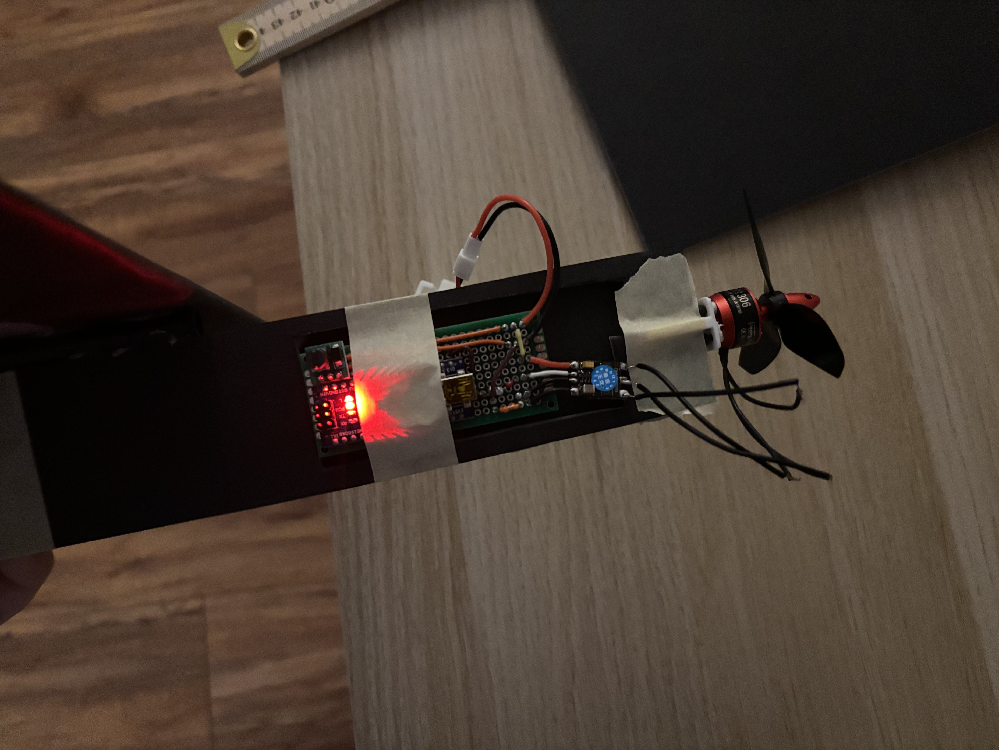
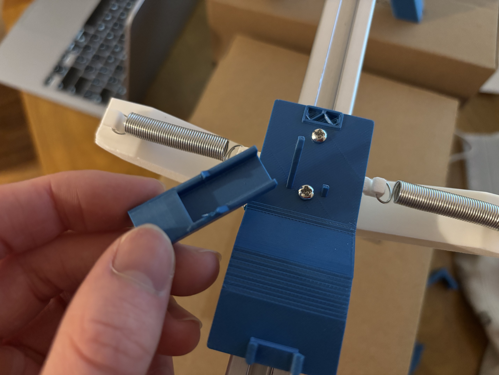

- Need to do a couple more things to test again.
	- Resolder 2 of the ESC outputs.
	- Print a new propeller (it broke on impact, PLA is brittle, and frankly the plane is not meant to crash).
	- Probably rebuild the fuselage. Could add some more height or something to make the electronics more secure, and maybe redesign so on impact the electronics aren't stressed as much.
- Did a bunch of stuff this evening.
	- Rebuilt the fuselage. No 3d printed mesh box to hold electronics, instead I just cut out a slot in one side of the foam board and taped the main prototype board in there. I put the battery and taped a quarter to the other side to even out the weight a bit. I later realized this still wasn't really enough. And it had a tendency to veer to one side a little.
		- 
	- I had bought some official propellers for this kind of motor, and just feeling the air behind and in front of the propeller at the same throttle, the difference is meaningful. I probably need to add more incline to the blades of my propeller, and maybe a third blade. Going to stick with the official one for testing purposes, and come back and redesign mine in the future.
	- Couple launcher issues. After several launches inside my apartment, I broke my launcher adapter. I had gussets to help out but clearly they weren't that strong. This isn't too hard to redesign. I had extended the length of adapter to keep the plane balanced, as the center of gravity is a bit farther forward than the back of the fuselage where the force is applied. I only realized afterwards that this is actually adding a lot of friction by pushing down the front of the sled. I should be able to rebalance it without blocking the trigger. Changes: strength + balance.
		- 
	- Launching: I launched in my apartment several times as initial tests before taking it outside. I wanted to get the most distance possible so I launched diagonally across my living room which meant launching over this little railing thing. In hindsight, this is unnecessarily high, and just led to more opportunities to nose dive and crash hard. My ideal is for my plane to just launch and glide straight without losing/gaining much altitude. It's sorta nice to give it a foot or two off the ground in case it needs to descend slightly, but generally, I'm probably better off just testing from the ground. Then I don't need to also do this jank box setup to raise my launcher and put it on unsteady grounding.
		- <video controls width="100%">
  <source src="powered_flight_test2.mp4" type="video/mp4">
</video>
	- I also just went ahead and threw it in the park just to see how it'd do since I felt like maybe I wasn't getting accurate results with my home setup. I got some okay data about how it glides generally after many throws, but after the first 2 throws my solder joints broke so I didn't get much chance with power. I need to lean into my launcher still. It's sort of hard enough to debug when I have to account for both the design of the aircraft, my throw, and the winds. Now I'm adding power into the mix. My launcher can take the throw variable out of the equation and make something consistent. It takes some work to get it right and fix any related issues there, but that's really worth doing to hone in on further improvements.
	- I generally have to hold my launcher in place whenever it launches, because of the force back from the aircraft. This is another variable/opportunity for error. I should somehow add tape or a weight to the ground to make it so I really can just press the button and let it fly.
	- Wind at night seems to be calmer. My thinking is heat from the sun mixing with air from the ocean might have something to do with it. Very anecdotal. Anyway this might be helpful for testing.
	- Pitch stability: Kinda felt it was nosediving a lot in my apartment so I added more incline to the tail, but realized once I got to the park how I had it originally was just fine. A single foam piece lifting the back of the tail up is enough incline. And in hindsight, the tail was actually hitting my finger on launch. Launching level with several inches in height between my finger and the tail, it was pitching up a bunch upon launch. Kind of interesting behavior, I wonder if it's because of the rapid increase in speed. Might need to account for this going forward.
	- I wonder how to solve the issues of my solder joints sucking. Is it just I'm bad at soldering, is there a way to soften this impact, or is there some stronger way of making my entire circuit (custom PCB?)?
	- Total weight right now is ~145g.

