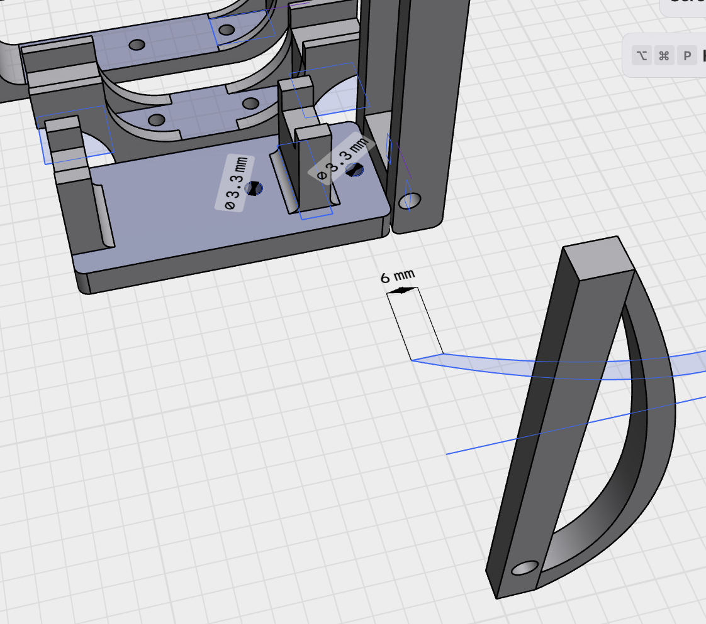
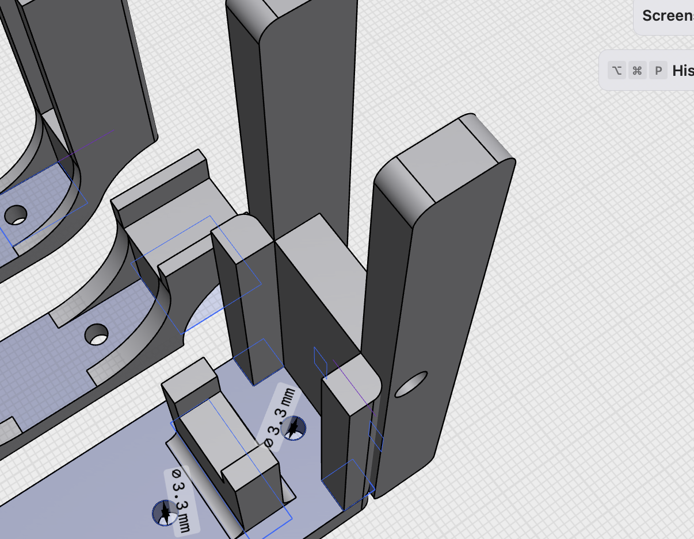

- Found this great [youtube channel the efficient engineer](https://www.youtube.com/@TheEfficientEngineer) today while looking into how i can make sure my new hinge launcher sticks won't break too easily.
- 
- 
- I want to push my plane from the wings so we don't pitch up. But then I sorta need these long sticks. There will be stress on the sticks and I was considering how to best ensure the bending strength of them. I opted to keep things simple and just make them thicker in the direction of the axis along the launcher channel. I'll print and iterate if they break too easily.
- I think I've got it roughly solved. Pushing by the wings and using a hinge seems to work decently. The launcher doesn't seem to have enough power to get the glider flying on it's own. Which is a little mysterious to me, because I handheld-launched my glider the other day and it flew great. But, this might be just fine with the power system.
- <video controls width="100%">
  <source src="launcher_slow_friction.mp4" type="video/mp4">
</video>
- It's not absolutely necessary, but I'd like to improve my electronics harnessing. Previously I just made a box that would encompass the full dimensions. And right now...
- I do not have the launcher solved. I had made some touch ups and tried again. I realized the power issue is real. I know the springs have enough power because I've done a handheld launch where the glider flew great. So now that my launcher is all good and ready, why isn't it gliding well?
- Well, now that we are pushing from the top, there's a lot of force trying to rotate the sled, and that's adding a lot of friction. Enough to slow it down significantly.
- I went on a walk and I think I have a good idea to fix this. Let's delete the sled entirely. Move the spring holster upwards, and just have a single holster for the vehicle that's suspended in air from the springs. the hook for the trigger can be attached to the holster. I'll probably need to redesign the trigger quite a bit, but I think this will solve the issues I've been having, and simplify the design further.
- Hmm, actually, i probably don't even have to redesign the trigger much. I can add small pieces to the trigger to slightly guide it. This will become clearer when I share the 3d model.

