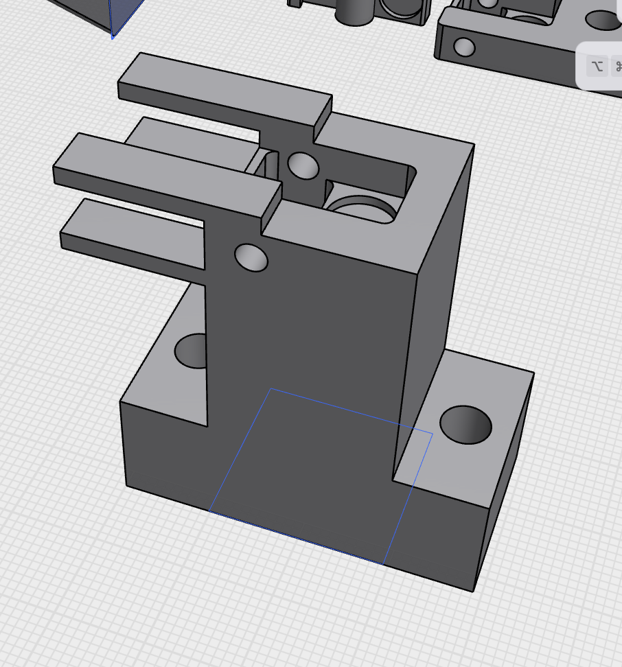
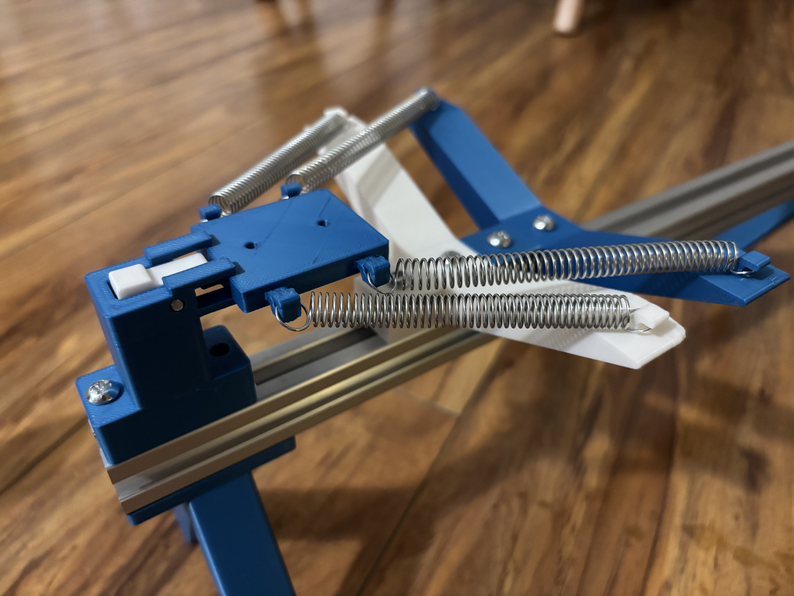

- Redesigning the launcher.
- 
- This is the new and improved trigger mechanism. Basically just lifted it up 3cm and added some rails to slot into.
- 
- Made a fine basic prototype of a sled-less launcher. Couldn't actually test it on my glider since the guide rails are blocked by the launch adapter when screwed in.
- I think it will make more sense to have the pairs of springs vertical, instead of in the z-axis right now. But this feels like it's growing in complexity, and I don't like that I'm sorta abusing 3d printing in making complicated geometries. I'm still going to just focus on getting something working for now.

