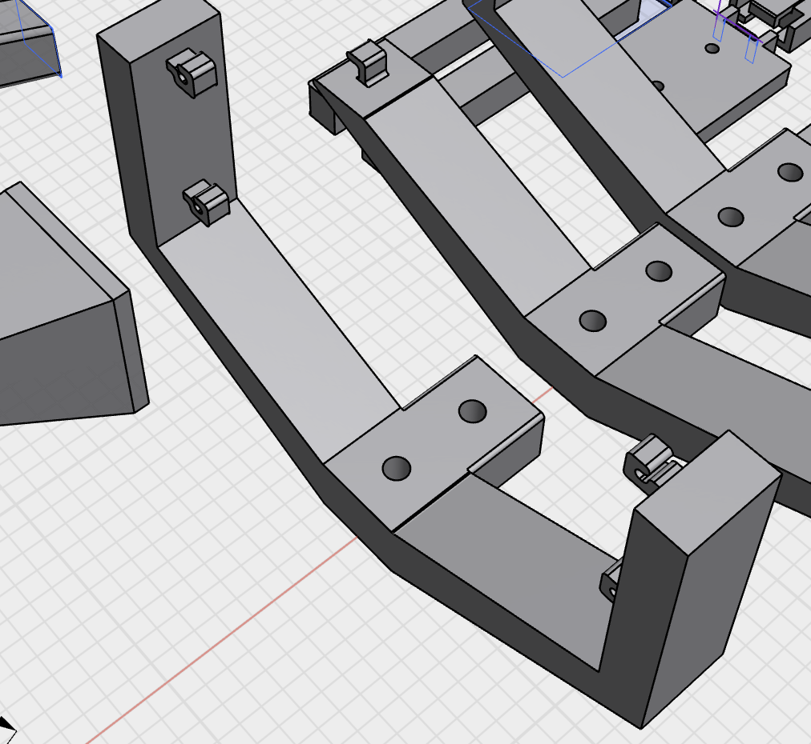
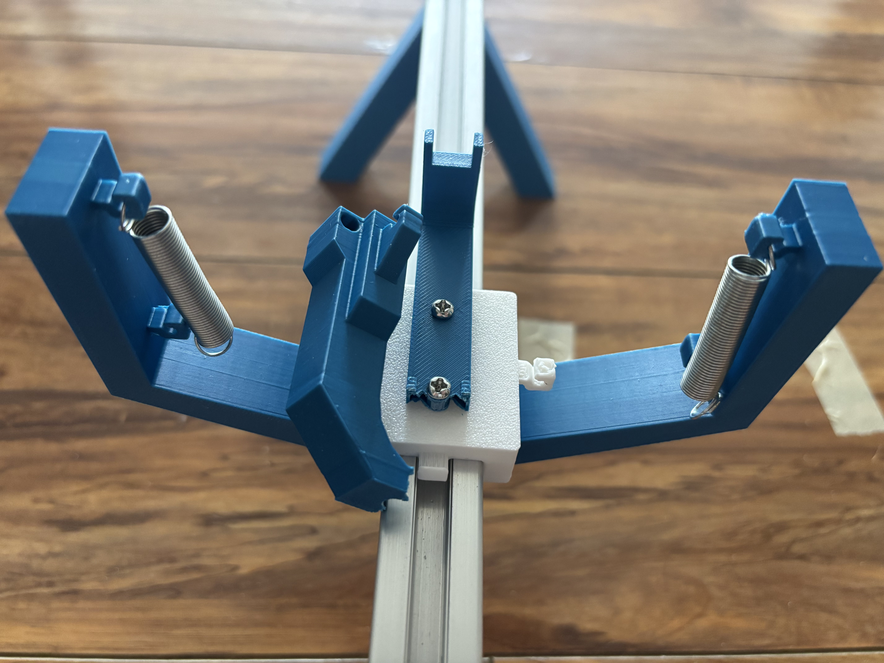

- Back from vacation. I tried this whole more vertical thing:
- 
- It feels like it's making things more complicated. Do I really need 4 springs for this?
- Tried another version with a sled again. This time instead of the springs being lower down and pulling the sled, they are higher up and pulling closer to the center of mass (in the z axis, up down axis). The trigger hook was still on the bottom so this cracked in half before i could even test it.
- 
- I am struggling with this launcher design.
