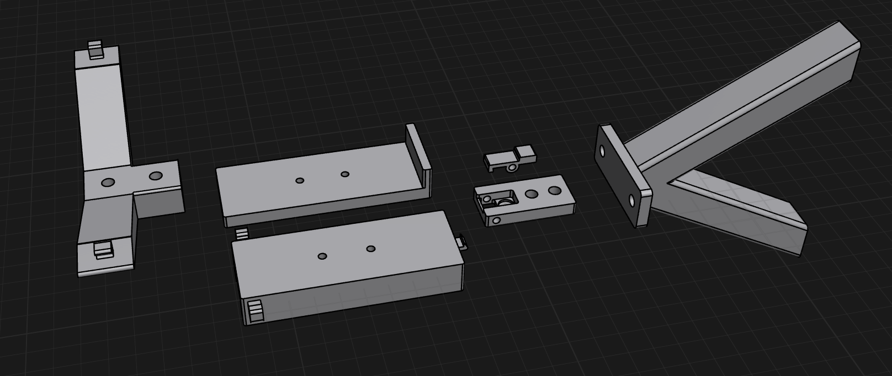

- What do I need to do to launch by the wings?
- Just build basically the same launcher I've been using, but duplicate them.
- Change the holster to be a short simple L shape.
- Make sure the spring hooks on the edges are low enough so the wing doesn't touch.
- Launch operations: pull back both sides to click, place aircraft, release both sides at same time.
- Can change later to make some sort of single release mechanism so I don't risk things being uneven.
- All the components for a single launcher:
	- 2x legs - 4x m4 bolts + t-nuts
	- 1x back anchor = platform + hook hinge + m3 bolt + compression spring + 2x m4 bolts + t-nuts
	- 1x v spring hook - 2x m4 bolts + t-nuts, 2x tension springs
	- 1x channel sled
	- 1x L-shape holster
	- 2x m3 nuts + bolts to fasten holster -> channel sled
- Here are all the components:
- 
- Changed some small things. The sled and holster are longer and the spring hooks are towards the front. No matter what there's always this rotation pressure on the sled so I wanted to counteract that by moving the hooks forward. Probably won't be critical but shouldn't hurt.
