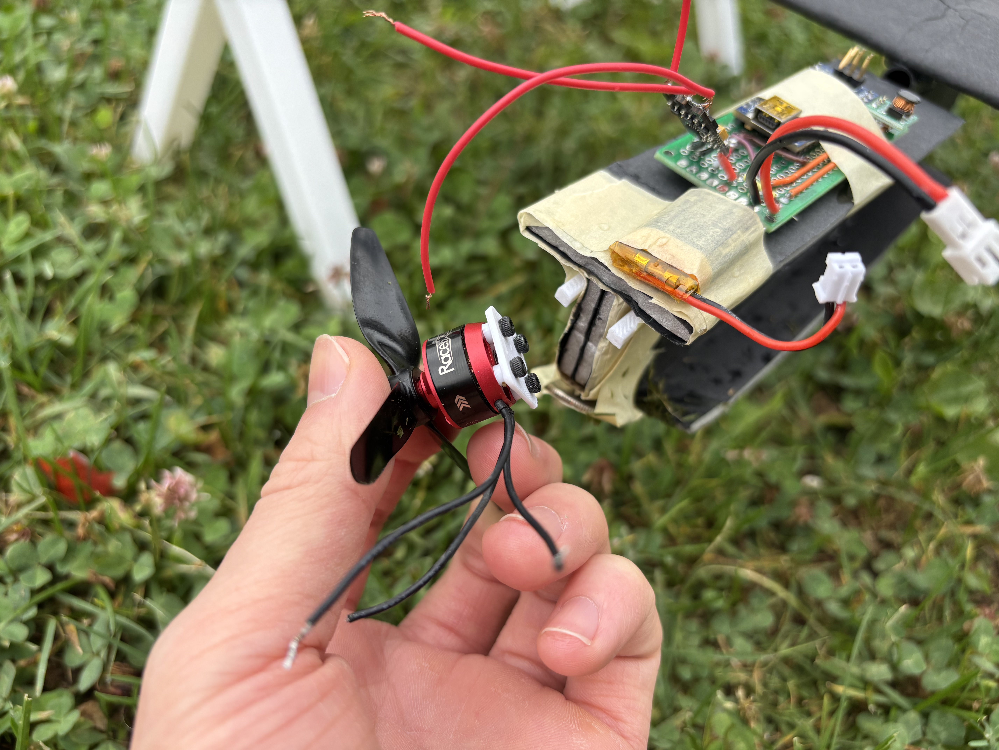

- 
- A new thing happened: propeller prongs broke after so many nosedives.
- This photo also shows the I-beam style fuselage. I'm realizing, I think the bottom flat board is actually adding non-trivial lift to the front of my aircraft, and it's messing up everything. I noticed the aircraft stalls super easily with only a slight pitch up, which I think is coming from extra lift + drag from that platform. There should be a rough simple fix here, which is to just extend the top platform and drop the bottom. That should make things structurally sound without adding as much extra surface area. I can probably trip some width off the top as well.
- Interesting quote from chapter 7 on "Principles of stability and control" from introduction to flight: "In general, adding a fuselage to a wing shifts the aerodynamic center forward, increases the lift curve slope, and contributes a negative increment to the moment about the aerodynamic center." I don't fully understand the negative increment to the moment about the AC. But the most interesting part to me is the fuselage adding lift moves the aerodynamic center forward, increasing the lift curve slope. I think this explains many of the symptoms to adding the flat pad to my fuselage. It definitely seemed to become far more unstable, and weigh more sensitive to the angle of attack.
- Items for today
	- re-print a mount for the propeller
	- reconstruct the fuselage
	- build a bigger plane
	- order new motor, propeller, ESC
