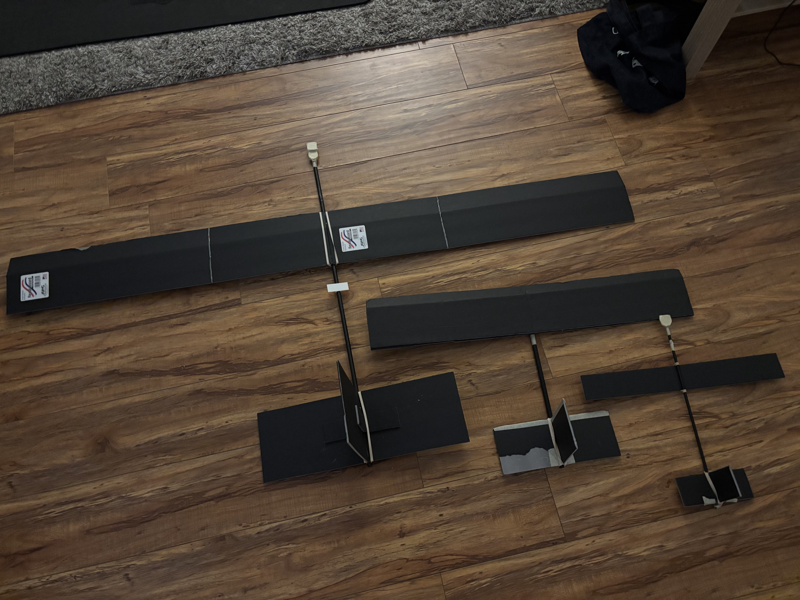
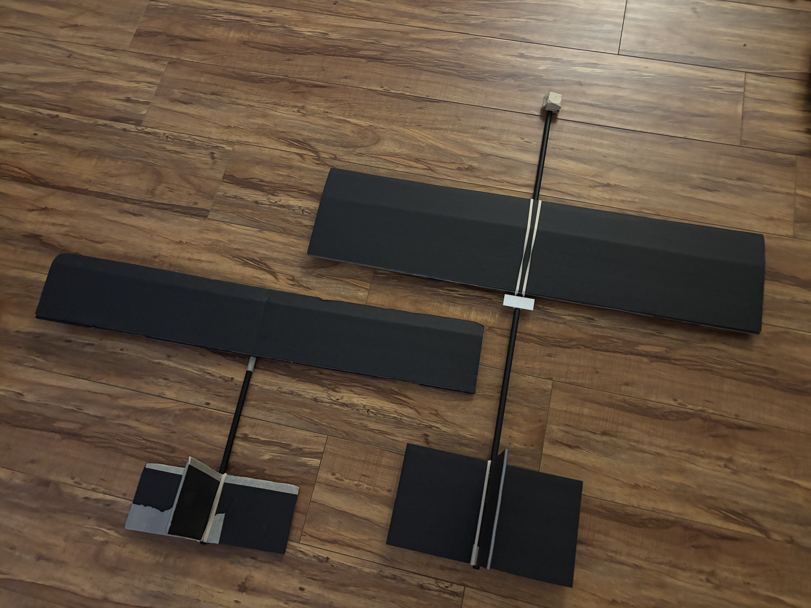

- Happy fourth!
- I built a bigger plane. I actually built 2 yesterday. 1 with just a lower aspect ratio and longer tail moment, and 1 that had 2x the wingspan. They both flew fine. I think they had noticeably better stability than my main design, but not because of anything super fundamental. I think I had just messed up my original design, and I need to just tune it to glide again before testing power again.
- Some things that I think could help: remove the second layer of foam on the wing (=1/2 as heavy, probably will drop overall mass by like 15%), and increase the tail moment arm. None of these are dealbreakers, but I think they will make things a little easier.
- 
- 
