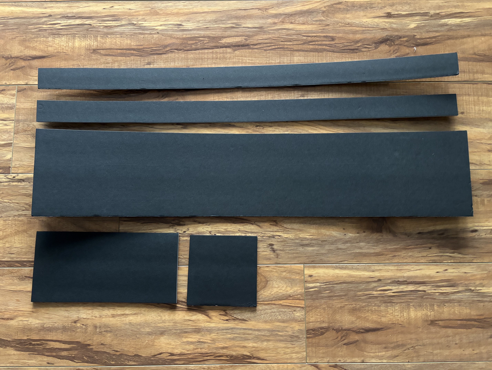
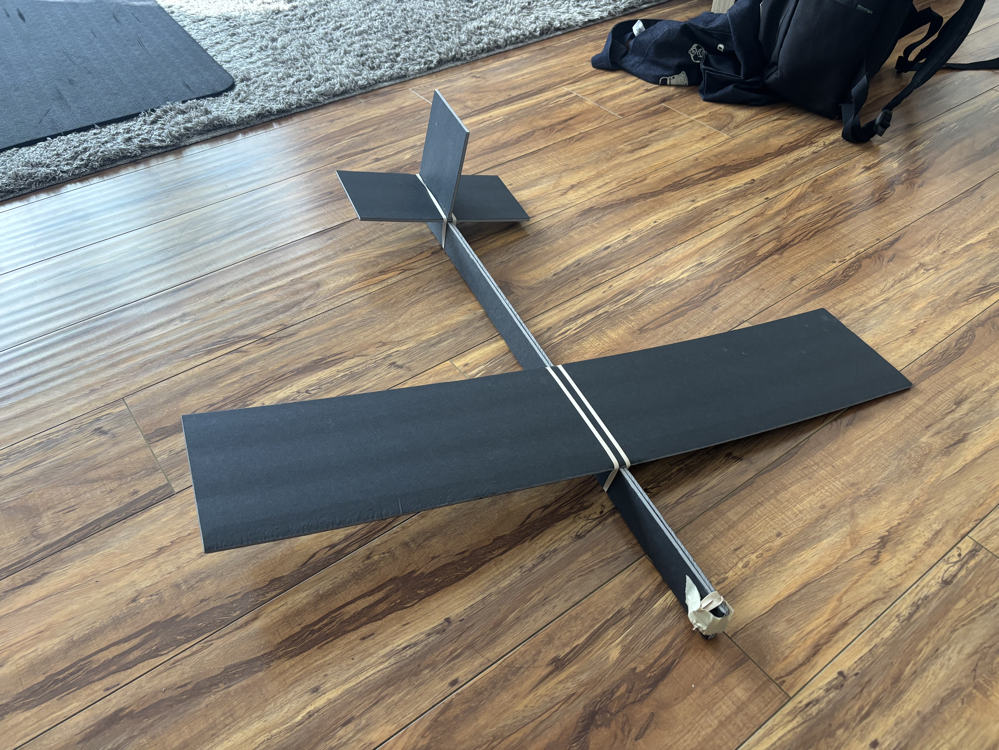

- I haven't reached by goal but I've broken past the plateau. Over the last couple of days I made the simple glider I described, trimmed it to glide on it's own, added the electronics, trimmed again, and it can glide for pretty long maybe 3-4 seconds in a fairly straight path. Here's a couple good shots:

- <video controls width="100%">
  <source src="post_plateau_pitch_up.mp4" type="video/mp4">
</video>

- <video controls width="100%">
  <source src="post_plateau_smooth_descend.mp4" type="video/mp4">
</video>

- I have built another airframe, with the same specs. Old one was getting worn down. Also noticed tilting on the wings being held by the rubber bands, which I realized is because of the way the fuselage is constructed. It's just two long pieces of foam board glued together, and if one is slightly taller than the other, the place where the wings/horizontal stabilizer sit will be lobsided. I was able to shape that to make it a little more sound.
- The construction is extremely simple and I can put it together from scratch in less than an hour (still kind of a lot, but I'm slow). It's just 4 rectangles. Held together with glue and rubber bands.
- 
- 
- After a bunch of testing my electronics are acting weird now. I've probably gone through like 5 rounds of soldering the output pads on the ESC. We're getting a weird inconsistent set of sounds from the ESC. I resoldered the pads and it didn't really help much. I sort of wonder if the connection could be between the signal coming back from the motor, so I've ordered a new motor just in case I need to test that later. I suspect it could also be some other loose connection, possibly where I connect ground to the battery. That is something I've needed to readjust many times to make things work, but its also getting worn now. Sort of hard to diagnose. I might just resolder a full prototype board. Not really sure how else I'd fix it even if I knew the issue. My first prototype board had an really crappy soldering job, honestly surprised it even worked as well as it did. If a new board works, I know the issue was some connection in the board. If it doesn't, then it's something between the ESC and the motor.
- Okay with some wiggle testing I found the wire sending signal to the ESC was breaking off. Might be able to repair it but might have to just redo the whole board.
